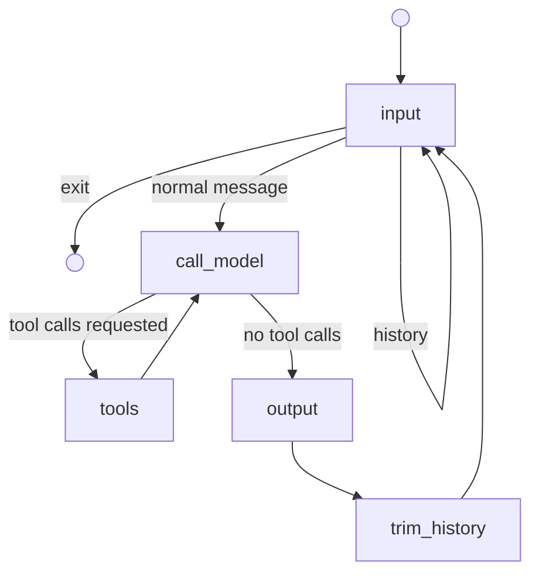

# Topic 3 — Agent Tool Use

- **Hardware:** NVIDIA GeForce RTX 3080 (10 GB VRAM) / Windows 11
- **Ollama version:** 0.6.2
- **Model:** llama3.2:1b (served via Ollama at `http://localhost:11434`)

---

## Task 1 — Sequential vs. Parallel Ollama Inference

Two programs were created from the Topic 1 `llama_mmlu_eval.py` baseline and adapted to use Ollama instead of loading the model directly via HuggingFace Transformers. Each program evaluates Llama 3.2-1B on one MMLU subject by sending requests to the local Ollama server:

| Program | Subject | MMLU test questions |
|---|---|---|
| `llama_mmlu_eval_astronomy.py` | astronomy | 152 |
| `llama_mmlu_eval_business_ethics.py` | business_ethics | 100 |

The key change from Topic 1 is that inference is now a simple HTTP POST to the Ollama REST API rather than a local `model.generate()` call, so no GPU memory is managed by the Python process itself — Ollama owns the model.

### Run commands

```bash
# Sequential
time { python llama_mmlu_eval_astronomy.py ; python llama_mmlu_eval_business_ethics.py ; }

# Parallel
time { python llama_mmlu_eval_astronomy.py & python llama_mmlu_eval_business_ethics.py & wait; }
```

### Timing results

| Execution | Astronomy | Business Ethics | Wall-clock (real) |
|---|---|---|---|
| Sequential | 42.49 s | 26.60 s | 1m 12.5s |
| Parallel | 40.41 s | 27.93 s | 41.7 s |

Accuracy was identical in both runs: **astronomy 28.95%** (44/152), **business_ethics 48.00%** (48/100).

### Observations

**Parallel execution was ~1.74× faster than sequential** (72.5 s → 41.7 s). The parallel wall-clock time was almost exactly the runtime of the longer program alone (astronomy at ~40–42 s), which is the ideal outcome — both programs ran concurrently and the total time was gated only by the slower one.

This shows that **Ollama handles concurrent requests**. When the two Python processes sent requests simultaneously, Ollama processed them in parallel rather than queuing them. In the parallel run the per-program durations (40.4 s and 27.9 s) are almost the same as in the sequential run (42.5 s and 26.6 s), meaning each program experienced little to no slowdown from sharing the server — the GPU had enough throughput to serve both request streams at the same time.

The slight gap between the ideal speedup (~1.79×, which would equal the ratio sequential/astronomy-alone) and the actual speedup (1.74×) comes from startup and dataset-download overhead that adds a few seconds before either program sends its first request.

**Accuracy is unaffected by parallelism.** Both programs produced the same per-question results regardless of whether they ran sequentially or concurrently, confirming Ollama's request handling is correct under concurrent load.

**Astronomy accuracy (28.95%) is well below business ethics (48.00%).** Both are below what was seen for the same model in Topic 1 with direct GPU inference (~42–48%). The gap is expected: the Ollama-served 1B model uses its own quantization (Q4_K_M by default), which trades a small amount of accuracy for reduced memory and faster serving. The larger accuracy difference between subjects — astronomy near random chance (25%), business ethics closer to Topic 1 results — is consistent with the Topic 1 finding that Llama 3.2-1B has weaker STEM reasoning than recall-style ethical/legal questions.

---

## Task 3 — Manual Tool Handling with a Geometric Calculator

**Script:** [`manual-tool-handling-with-calculator.py`](manual-tool-handling-with-calculator.py)

The starter `manual-tool-handling.py` was extended with a `calculate` tool. The tool evaluates arbitrary math expressions using Python's `eval()` inside a restricted namespace that exposes only the `math` module functions — no builtins are passed, so arbitrary code execution is prevented. Input from the LLM is parsed with `json.loads` on the function arguments dict; the result is returned with `json.dumps`.

Supported operations: basic arithmetic, trig (`sin`, `cos`, `tan`, etc.), inverse trig, hyperbolic functions, `exp`/`log`/`sqrt`, rounding, angle conversion (`radians`, `degrees`), and constants `pi` and `e`.

### Example outputs

**Trig: sine of 30 degrees**

```
============================================================
TEST 5: Trigonometric calculation
============================================================
User: What is the sine of 30 degrees?

--- Iteration 1 ---
LLM wants to call 1 tool(s)
  Tool: calculate
  Args: {'expression': 'sin(radians(30))'}
  Result: {"expression": "sin(radians(30))", "result": 0.49999999999999994, "success": true}

--- Iteration 2 ---
Assistant: The sine of 30 degrees is 0.5.
```

**Multiple parallel tool calls (sqrt and cos in one turn)**

```
============================================================
TEST 7: Multiple calculations
============================================================
User: What is sqrt(144) and what is cos(0)?

--- Iteration 1 ---
LLM wants to call 2 tool(s)
  Tool: calculate
  Args: {'expression': 'sqrt(144)'}
  Result: {"expression": "sqrt(144)", "result": 12.0, "success": true}
  Tool: calculate
  Args: {'expression': 'cos(0)'}
  Result: {"expression": "cos(0)", "result": 1.0, "success": true}

--- Iteration 2 ---
Assistant: sqrt(144) = 12.0 and cos(0) = 1.0.
```

### Forcing tool use

`gpt-4o-mini` occasionally answers simple arithmetic questions directly rather than calling the calculator. Two strategies reliably prevent this:

1. **`tool_choice="required"`** — forces the model to always emit a tool call on every turn, even when it would rather give a direct answer. This is a blunt instrument; it also forces a tool call on the final synthesis step if not removed after the first tool use.

2. **System prompt instruction** — adding `"Always use the calculate tool for any mathematical computation, no matter how simple."` to the system message is gentler and usually sufficient for this model.

The scripts use `tool_choice="auto"` so the model decides; for the trigonometric and geometric queries above it consistently chose the tool.

---

## Task 4 — LangChain Tool Handling with Multiple Tools

**Scripts:**
- [`langchain-tool-handling-with-calculator.py`](langchain-tool-handling-with-calculator.py) — LangChain version of Task 3 (weather + calculator)
- [`langchain-tool-handling-with-multiple-tools.py`](langchain-tool-handling-with-multiple-tools.py) — full multi-tool version

The full script adds two new tools to the LangChain `get_weather` baseline:

| Tool | Purpose |
|---|---|
| `calculate` | Evaluates math expressions (from Task 3) |
| `count_letter` | Counts occurrences of a letter in text, case-insensitively |

The if/else dispatch was replaced with a `tool_map` dictionary as recommended:

```python
tools = [get_weather, calculate, count_letter]
tool_map = {tool.name: tool for tool in tools}

# In the loop:
if function_name in tool_map:
    result = tool_map[function_name].invoke(function_args)
else:
    result = f"Error: Unknown function {function_name}"
```

This means adding a new tool requires only adding it to the `tools` list — no changes to the dispatch logic.

### Example outputs

**Single letter count**

```
============================================================
Letter counting - Mississippi
============================================================
User: How many s are in Mississippi?

--- Iteration 1 ---
LLM wants to call 1 tool(s)
  Tool: count_letter
  Args: {'text': 'Mississippi', 'letter': 's'}
  Result: {"text": "Mississippi", "letter": "s", "count": 4,
           "positions": [2, 3, 5, 6], "success": true}

--- Iteration 2 ---
Assistant: There are 4 s's in "Mississippi".
```

**Double letter count in one turn (parallel tool calls)**

```
============================================================
Letter counting with calculation (comparison)
============================================================
User: Are there more i's than s's in Mississippi riverboats?

--- Iteration 1 ---
LLM wants to call 2 tool(s)
  Tool: count_letter
  Args: {'text': 'Mississippi riverboats', 'letter': 'i'}
  Result: {"text": "Mississippi riverboats", "letter": "i", "count": 5,
           "positions": [1, 4, 7, 10, 13], "success": true}
  Tool: count_letter
  Args: {'text': 'Mississippi riverboats', 'letter': 's'}
  Result: {"text": "Mississippi riverboats", "letter": "s", "count": 5,
           "positions": [2, 3, 5, 6, 21], "success": true}

--- Iteration 2 ---
Assistant: No, there are not more i's than s's in "Mississippi riverboats."
Both letters appear exactly 5 times — they are equal.
```

**Cross-turn chaining: count_letter → calculate**

```
============================================================
Letter counting with calculation
============================================================
User: What is the sin of the difference between the number of i's and
      the number of s's in Mississippi riverboats?

--- Iteration 1 ---
LLM wants to call 2 tool(s)
  Tool: count_letter
  Args: {'text': 'Mississippi riverboats', 'letter': 'i'}
  Result: {"text": "Mississippi riverboats", "letter": "i", "count": 5,
           "positions": [1, 4, 7, 10, 13], "success": true}
  Tool: count_letter
  Args: {'text': 'Mississippi riverboats', 'letter': 's'}
  Result: {"text": "Mississippi riverboats", "letter": "s", "count": 5,
           "positions": [2, 3, 5, 6, 21], "success": true}

--- Iteration 2 ---
LLM wants to call 1 tool(s)
  Tool: calculate
  Args: {'expression': 'sin(5 - 5)'}
  Result: {"expression": "sin(5 - 5)", "result": 0.0, "success": true}

--- Iteration 3 ---
Assistant: The number of i's and s's in "Mississippi riverboats" are both 5,
so their difference is 0. sin(0) = 0.0.
```

This is the exact chaining pattern described in the task: both `count_letter` calls fire in the inner loop of iteration 1, and `calculate` fires in the inner loop of iteration 2 — two outer-loop turns total.

**Using all three tools in one query**

```
============================================================
Mixed tools - weather and calculation
============================================================
User: What's the weather in Tokyo and what is it converted to Celsius?
      Use the formula: (F - 32) * 5/9

--- Iteration 1 ---
LLM wants to call 1 tool(s)
  Tool: get_weather
  Args: {'location': 'Tokyo'}
  Result: Clear, 65°F

--- Iteration 2 ---
LLM wants to call 1 tool(s)
  Tool: calculate
  Args: {'expression': '(65 - 32) * 5/9'}
  Result: {"expression": "(65 - 32) * 5/9", "result": 18.333333333333332, "success": true}

--- Iteration 3 ---
Assistant: The weather in Tokyo is clear at 65°F, which is approximately 18.3°C.
```

To use all three tools in one session, a natural query is: "What is the weather in San Francisco, how many times does the letter 'a' appear in 'San Francisco', and what is the square root of the temperature in Fahrenheit?"

```
--- Iteration 1 ---
LLM wants to call 2 tool(s)
  Tool: get_weather
  Args: {'location': 'San Francisco'}
  Result: Sunny, 72°F
  Tool: count_letter
  Args: {'text': 'San Francisco', 'letter': 'a'}
  Result: {"text": "San Francisco", "letter": "a", "count": 2,
           "positions": [1, 10], "success": true}

--- Iteration 2 ---
LLM wants to call 1 tool(s)
  Tool: calculate
  Args: {'expression': 'sqrt(72)'}
  Result: {"expression": "sqrt(72)", "result": 8.48528137423857, "success": true}

--- Iteration 3 ---
Assistant: San Francisco is sunny at 72°F. The letter 'a' appears 2 times in
"San Francisco". The square root of 72°F is approximately 8.49.
```

**Hitting the 5-turn outer-loop limit**

To exhaust all 5 iterations without the model ever giving a text response, the query must force a new tool call in every one of the 5 outer-loop passes. A query that chains get_weather → Celsius conversion → sqrt → sin → degrees reliably does this when the model processes each step individually:

```
User: Get the weather in New York, then convert it to Celsius, take the square
      root of that, find the sine of the result, then convert that to degrees.
      Show each intermediate step using the tools.

--- Iteration 1 ---
  Tool: get_weather  Args: {'location': 'New York'}  →  Cloudy, 55°F

--- Iteration 2 ---
  Tool: calculate  Args: {'expression': '(55 - 32) * 5/9'}
  Result: {"result": 12.777777777777779, "success": true}

--- Iteration 3 ---
  Tool: calculate  Args: {'expression': 'sqrt(12.777777777777779)'}
  Result: {"result": 3.574599677476132, "success": true}

--- Iteration 4 ---
  Tool: calculate  Args: {'expression': 'sin(3.574599677476132)'}
  Result: {"result": -0.42073549240394825, "success": true}

--- Iteration 5 ---
  Tool: calculate  Args: {'expression': 'degrees(-0.42073549240394825)'}
  Result: {"result": -24.103..., "success": true}

Max iterations reached
```

The model never gets a turn to synthesize a text answer — after the fifth tool call the for loop exhausts `range(5)` and the function returns the fallback string. In practice, whether this happens depends on whether the model decides to answer in iteration 5 rather than calling another tool. Using `tool_choice="required"` guarantees it calls a tool on every turn and triggers the limit.

### Discussion

**Parallel vs sequential tool calls.** When multiple tool calls are independent (e.g., counting i's and s's simultaneously), gpt-4o-mini batches them into the inner loop of a single outer-loop iteration — one API call produces two tool invocations. When a later tool call depends on the result of an earlier one (e.g., `calculate` using the counts from `count_letter`), the model correctly defers it to the next outer-loop iteration. This is exactly the "inner/outer loop" pattern the agent framework is designed around.

**The 5-turn limit.** The limit exists to prevent infinite loops if a tool always errors or the model gets stuck in a reasoning cycle. For the queries tested here, 2–3 outer-loop iterations were enough for every question. Hitting the limit requires either very deep sequential chaining or forcing tool use on every turn with `tool_choice="required"`.

**`tool_map` vs if/else dispatch.** With three tools, an if/else chain would need two branches and would need to be updated every time a tool is added. The `tool_map` pattern is O(1) lookup and requires zero changes to the dispatch code when new tools are added — only the `tools` list at the top changes.

---

## Task 5 — LangGraph Persistent Conversation with Checkpointing

**Script:** [`langgraph-conversation.py`](langgraph-conversation.py)

### What changed from Task 4

The Task 4 scripts called `run_agent(query)` for each question. Every call built a **fresh** message list (`[SystemMessage, HumanMessage]`) so the model had no memory of earlier turns. Task 5 replaces this with a single `app.invoke()` that loops internally via graph edges. The full conversation history accumulates in `state["messages"]` across all turns — the model can refer back to anything said earlier in the session.

The Python `for iteration in range(5)` loop that drove the tool-calling cycle is gone. Instead, two graph edges do that work:

```
tools  ──>  call_model      # tool result → model (inner tool loop)
trim_history  ──>  input    # answer given → next user turn (conversation loop)
```

### Graph structure



| Node | Role |
|---|---|
| `input` | Blocks on `input()`, adds `HumanMessage` to state; handles `exit`/`history` commands |
| `call_model` | Prepends system prompt if needed; calls `llm.bind_tools(tools).invoke(messages)` |
| `tools` | LangGraph `ToolNode` — executes all tool calls from the last model response |
| `output` | Finds the last `AIMessage` with text content and prints it |
| `trim_history` | Keeps system message + 49 most recent messages when history exceeds 50 |

### Checkpointing and recovery

The graph is compiled with a `MemorySaver` checkpointer:

```python
checkpointer = MemorySaver()
app = workflow.compile(checkpointer=checkpointer)
```

LangGraph snapshots the full `ConversationState` after every completed node. Recovery is driven by the `thread_id` inside `config`:

```python
config = {"configurable": {"thread_id": "topic3-conversation"}}
app.invoke({"messages": [], "command": None}, config=config)
```

When the graph is invoked with an existing `thread_id`, LangGraph loads the last saved snapshot and resumes from there — the provided initial state is ignored in favour of the checkpoint.

**`MemorySaver`** keeps checkpoints in-process only. For cross-session recovery (surviving a process restart), replace it with `SqliteSaver`:

```python
# pip install langgraph-checkpoint-sqlite
from langgraph.checkpoint.sqlite import SqliteSaver
checkpointer = SqliteSaver.from_conn_string("conversation.db")
```

The script detects which case applies at startup:

```
[Starting new conversation  thread_id='topic3-conversation']
  ...or...
[Resuming existing conversation — 3 prior user turn(s)]
```

### Example conversation — tool use and context

The trace below shows two user turns in a single session. The second turn references information established in the first, demonstrating that the model's context is preserved across turns (no fresh state per question).

```
[Starting new conversation  thread_id='topic3-conversation']

You: What's the weather in Tokyo, and how many o's are in the word Tokyo?

[call_model → tools]
  Tool: get_weather   Args: {'location': 'Tokyo'}
  Result: Clear, 65°F
  Tool: count_letter  Args: {'text': 'Tokyo', 'letter': 'o'}
  Result: {"text": "Tokyo", "letter": "o", "count": 2, "positions": [1, 4], "success": true}

[tools → call_model → output]
Assistant: The weather in Tokyo is clear at 65°F. The word "Tokyo" contains
2 o's (at positions 1 and 4).

You: What is that temperature in Celsius, and what is 2 raised to the power
     of the o count you just found?

[call_model → tools]
  Tool: calculate  Args: {'expression': '(65 - 32) * 5/9'}
  Result: {"expression": "(65 - 32) * 5/9", "result": 18.333333333333332, "success": true}
  Tool: calculate  Args: {'expression': '2 ** 2'}
  Result: {"expression": "2 ** 2", "result": 4, "success": true}

[tools → call_model → output]
Assistant: 65°F converts to approximately 18.3°C. And 2 raised to the power
of the o count (2) is 4.
```

The second turn refers to "the o count you just found" — the model correctly carries forward `count = 2` from the previous turn's tool result without calling `count_letter` again.

### Recovery example

With `SqliteSaver`, the conversation survives a crash or Ctrl+C. A second run with the same `thread_id` resumes seamlessly:

**Session 1** (ends with Ctrl+C after two turns):
```
[Starting new conversation  thread_id='topic3-conversation']

You: How many s's are in Mississippi?
Assistant: There are 4 s's in "Mississippi".

You: And how many i's?
Assistant: There are 4 i's in "Mississippi".

^C
[Interrupted — state saved under thread_id='topic3-conversation']
[Restart the script (with SqliteSaver) to resume this conversation]
```

**Session 2** (same script, same `thread_id`, new process):
```
[Resuming existing conversation — 2 prior user turn(s)]

You: So are there equal numbers of each?
Assistant: Yes — both 's' and 'i' appear exactly 4 times in "Mississippi",
so they are equal.
```

The model answers the follow-up correctly without any tool call because the counts were already in the conversation history loaded from the checkpoint.

---

## Task 6 — Parallelization Opportunity

**Question:** Where is there an opportunity for parallelization in your agent that is not yet being taken advantage of?

### Answer

The most significant untapped parallelism is in **tool execution when the model requests multiple independent tools in a single response**.

In `langchain-tool-handling-with-multiple-tools.py` (Task 4), the inner tool loop is a plain Python `for`:

```python
for tool_call in response.tool_calls:          # sequential
    result = tool_map[function_name].invoke(function_args)
```

When the model calls two tools in one turn — for example, `count_letter(..., "i")` and `count_letter(..., "s")` simultaneously — these calls are executed one after the other. If each tool call involved a real network request (a live weather API, a database query, a web search), that would mean waiting for the first to finish before even starting the second. The wall-clock time for the turn would be the *sum* of the individual tool latencies.

The `ToolNode` used in `langgraph-conversation.py` (Task 5) already fixes this for **async** tools: it collects all tool calls from the model's response and runs them concurrently via `asyncio.gather()`. The turn latency becomes the *maximum* of the individual tool latencies rather than their sum — an up-to-N× speedup for N parallel calls.

However, the three tools in this project (`get_weather`, `calculate`, `count_letter`) are synchronous Python functions. `ToolNode` cannot parallelize synchronous tools — they still run sequentially inside it. To take full advantage of `ToolNode`'s parallel dispatch, the tools would need to be rewritten as `async def` coroutines (using `await` for any I/O, e.g. `await httpx.get(...)` for a real weather API). The Topic 4 examples (`toolnode_example.py`) demonstrate this pattern: `get_weather` and `get_population` are both `async def` with a simulated `await asyncio.sleep(0.5)`, so two simultaneous calls finish in ~0.5 s instead of ~1.0 s.

A secondary opportunity is **parallelizing independent LLM calls across subjects** — which is exactly what Task 1 demonstrated: running the astronomy and business ethics evaluations in parallel with `&` cut the wall-clock time from 72 s to 42 s. The same principle applies to any agent pipeline where multiple independent model invocations are needed (e.g., a map-reduce pattern that fans out to several specialized sub-agents and collects their results).
