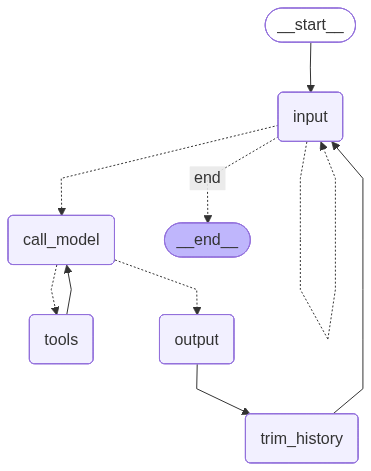
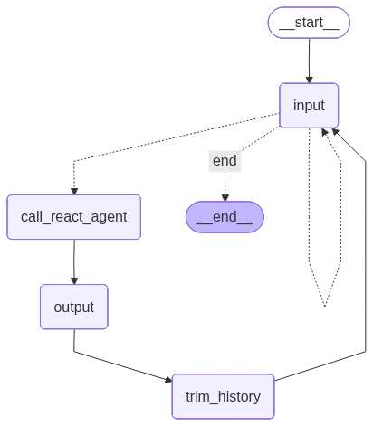

# Topic 4: LangGraph Tool Calling — Portfolio Questions

## Task 3: ToolNode vs. ReAct Agent

### What features of Python does ToolNode use to dispatch tools in parallel? What kinds of tools would most benefit from parallel dispatch?

`ToolNode` leverages Python's `asyncio` concurrency model to execute multiple tool calls simultaneously. The key language features involved are:

- **`async def` / `await`** — tools are defined as coroutines (see `toolnode_example.py` lines 44, 60, 76), allowing them to suspend while waiting for I/O without blocking the thread.
- **`asyncio.gather()`** — `ToolNode` internally collects all tool calls requested by the model in a single LLM response and runs them concurrently via `asyncio.gather()` (or equivalent), rather than sequentially.
- **The `asyncio` event loop** — a single-threaded cooperative scheduler that interleaves coroutines whenever one yields control with `await`.

Tools that benefit most from parallel dispatch are **I/O-bound** tools: anything that spends most of its time waiting for an external response rather than doing CPU work. Examples include:

- HTTP/REST API calls (weather, search, geocoding)
- Database queries
- File or cloud storage reads
- Web scraping or browser automation

In the example, `get_weather` and `get_population` each simulate a 0.5-second API delay. If a user asks "What is the weather and population of Paris?", the ToolNode approach fires both calls simultaneously and finishes in ~0.5 s instead of the sequential ~1.0 s. CPU-bound tools (e.g., the `calculate` tool) gain almost nothing from parallel dispatch because they never yield the event loop.

---

### How do the two programs handle special inputs such as "verbose" and "exit"?

Both programs use **identical logic** in their `input_node` function and `route_after_input` router. Special inputs are intercepted before any message is added to the conversation history:

| Input | State change | Routing |
|-------|-------------|---------|
| `quit` / `exit` | `command = "exit"` | `route_after_input` returns `"end"` → `END` node |
| `verbose` | `command = "verbose"`, `verbose = True` | Returns `"input"` → loops back to `input_node` |
| `quiet` | `command = "quiet"`, `verbose = False` | Returns `"input"` → loops back to `input_node` |
| anything else | `command = None`, message appended to history | Returns `"call_model"` / `"call_react_agent"` |

The key design choice is that special commands **never enter the message history**. Instead, they set a dedicated `command` field in the graph state, which the routing function reads to decide the next node. This prevents "verbose" or "exit" from being sent to the LLM as conversational messages. For `verbose`/`quiet`, the graph self-loops back to `input_node` immediately so the user can type their next real message. For `exit`, the graph routes to `END`, terminating the `ainvoke` call.

---

### Compare the graph diagrams of the two programs. How do they differ if at all?

**`toolnode_example.py`** produces a **single graph** (`langchain_manual_tool_graph.png`) that exposes the full tool-calling loop as explicit nodes and edges:



```
input ──(exit)──> END
  │  └──(verbose/quiet)──> input (self-loop)
  └──(normal)──> call_model ──(tool calls?)──> tools ──> call_model
                                └──(no tools)──> output ──> trim_history ──> input
```

The `call_model ↔ tools` cycle is visible in the diagram. You can see exactly where tool execution happens and that it loops back to the model.

**`react_agent_example.py`** produces **two graphs**:

1. **`langchain_react_agent.png`** — the internal ReAct agent sub-graph (created by `create_react_agent`), which shows the thought/action/observation loop: `agent → tools → agent`, ending at a terminal node when no more tools are needed.

   

2. **`langchain_conversation_graph.png`** — the outer conversation wrapper, which looks much simpler and **hides** the tool loop:

   

```
input ──(exit)──> END
  │  └──(verbose/quiet)──> input (self-loop)
  └──(normal)──> call_react_agent ──> output ──> trim_history ──> input
```

The core difference is **where the tool-calling loop lives**. In `toolnode_example.py` it is explicit in the outer graph (you see `call_model` and `tools` as separate nodes connected by edges). In `react_agent_example.py` the loop is encapsulated inside the `create_react_agent` sub-graph — the outer wrapper only sees a single black-box `call_react_agent` node. The ReAct outer wrapper therefore has fewer nodes and edges; the tool routing is only visible if you look at the inner agent's graph separately.

---

### What is an example of a case where the structure imposed by the LangChain ReAct agent is too restrictive and you'd want to pursue the ToolNode approach?

`create_react_agent` hard-codes a single loop: call model → if tool calls, execute them all → feed results back to model → repeat. You cannot inject custom logic between steps.

**Example: Human-in-the-loop approval for sensitive tool calls.**

Suppose you are building an agent that can both `read_file` (safe, run automatically) and `delete_file` (destructive, requires human confirmation). With the ReAct agent, there is no hook to intercept specific tool calls before they execute — the agent runs all requested tools uniformly.

With the manual ToolNode approach, you can add a custom routing step after `call_model` that inspects which tools were requested:

- If only safe tools were called → go directly to `tools` (auto-execute).
- If a destructive tool was called → go to a `human_approval` node that prints a prompt, waits for `y/n`, and either proceeds to `tools` or routes back to `call_model` with a rejection message.

This kind of **conditional, tool-aware routing** is impossible to express inside `create_react_agent` without modifying its internals. Any scenario requiring different downstream behavior based on *which* tool was requested — branching workflows, parallel sub-agents triggered by specific tool results, or rate-limiting certain tools — similarly benefits from the explicit ToolNode approach.

---

## Task 5: YouTube Educational Video Agent

**Project:** [agent_project/youtube_agent.py](agent_project/youtube_agent.py)

### Overview

A conversational agent that helps students learn from YouTube videos. Given any YouTube URL, it fetches the video's transcript and produces three outputs:

- **Summary** — a 3–5 sentence overview of the video's main message
- **Key Concepts** — a bulleted list of 5–8 terms or ideas with one-sentence explanations
- **Quiz Questions** — 5 questions (mix of multiple-choice and short-answer) with answers

### Architecture

The agent uses `create_react_agent` from LangGraph with a single tool, `get_youtube_transcript`, and a system prompt that instructs the LLM to always produce all three sections. This is an appropriate use of the ReAct pattern because the workflow is linear: one tool call to fetch the transcript, followed by LLM-generated analysis — no conditional routing between tools is needed.

```
user URL → get_youtube_transcript tool → LLM generates summary + concepts + quiz
```

### Running

```bash
cd topic4/agent_project
python youtube_agent.py
```

Paste any YouTube URL at the prompt. Type `exit` to quit.

**Dependency:** `pip install youtube-transcript-api`
